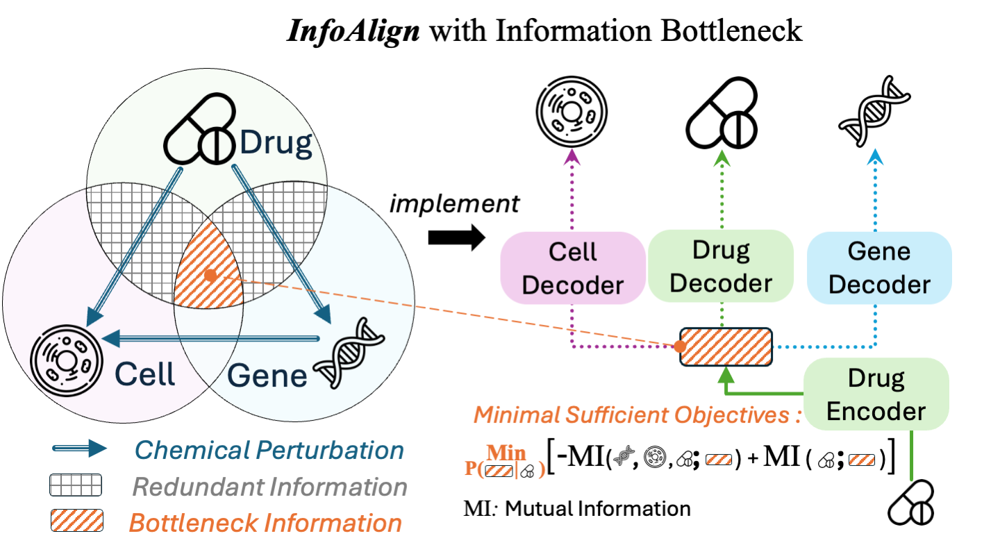

# Learning Molecular Representation in a Cell

InfoAlign learns molecular representation from bottleneck information derived from molecular structures, cell morphology, and gene expressions. Readers are referred to the paper for more details: https://arxiv.org/abs/2406.12056v1.



## Requirements

This code was developed and tested with Python 3.11.7, PyTorch 2.1.0+cu118, and torch-geometric 2.5.2. All dependencies are specified in the `requirements.txt` file.

## Usage

### Fine-tuning

We provide a checkpoint which can be downloaded from [Hugging Face](https://huggingface.co/liuganghuggingface/InfoAlign-Pretrained). Please place the model weights (`pretrain.pt`) under the `ckpt` folder along with its configurations in the YAML file.

For fine-tuning and inference, use the following code:

```bash
python main.py --model-path ckpt/pretrain.pt --dataset finetune-chembl2k

python main.py --model-path ckpt/pretrain.pt --dataset finetune-broad6k

python main.py --model-path ckpt/pretrain.pt --dataset finetune-biogenadme

python main.py --model-path ckpt/pretrain.pt --dataset finetune-moltoxcast
```

Note: Please visit [Hugging Face](https://huggingface.co/liuganghuggingface/InfoAlign-Pretrained) for the cell morphology and gene expression features in the ChEMBL2k and Broad6K datasets.

### Pretraining

To pretrain the model from scratch, first download the pretraining dataset from [Hugging Face](https://huggingface.co/datasets/liuganghuggingface/InfoAlign-Data). Place all pretrain data files under the `raw_data/pretrain/raw` folder. Then run the following code:

```bash
python main.py --model-path "ckpt/pretrain.pt" --lr 1e-4 --wdecay 1e-8 --batch-size 3072
```

The pretrained result will be saved in the `ckpt` folder with the name `pretrain.pt`.


## Data source

For readers interested in data collection, here are the sources:

1. **Cell Morphology Data**
   - JUMP dataset: The data are from "JUMP Cell Painting dataset: morphological impact of 136,000 chemical and genetic perturbations" and can be downloaded [here](https://github.com/jump-cellpainting/datasets/blob/1c245002cbcaea9156eea56e61baa52ad8307db3/profile_index.csv). The dataset includes chemical and genetic perturbations for cell morphology features.
   - Bray's dataset: "A dataset of images and morphological profiles of 30,000 small-molecule treatments using the Cell Painting assay". Download from [GigaDB](http://gigadb.org/dataset/100351). Processed version available on [Zenodo](https://zenodo.org/records/7589312).

2. **Gene Expression Data**
   - LINCS L1000 gene expression data from the paper "Drug-induced adverse events prediction with the LINCS L1000 data": [Data](https://maayanlab.net/SEP-L1000/#download).

3. **Relationships**
   - Gene-gene, gene-compound relationships from Hetionet: [Data](https://github.com/hetio/hetionet).